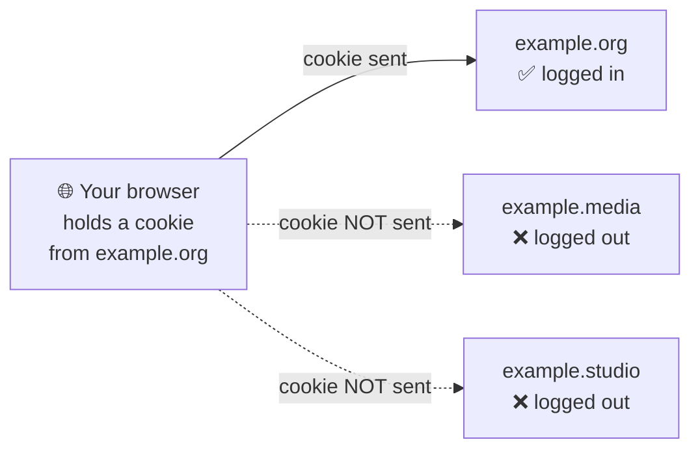
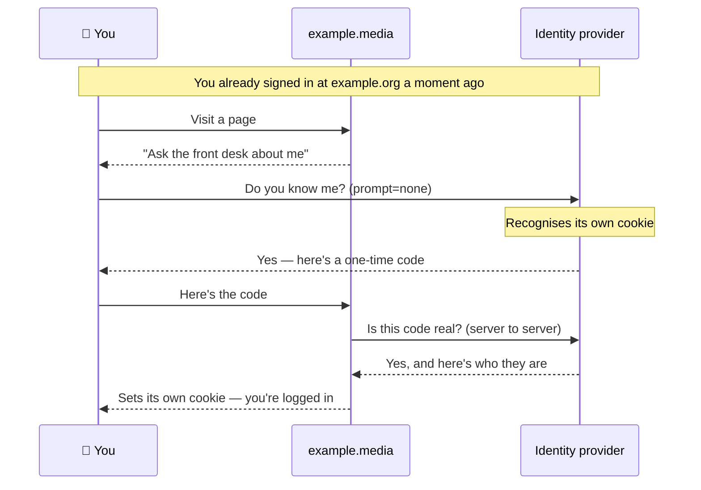
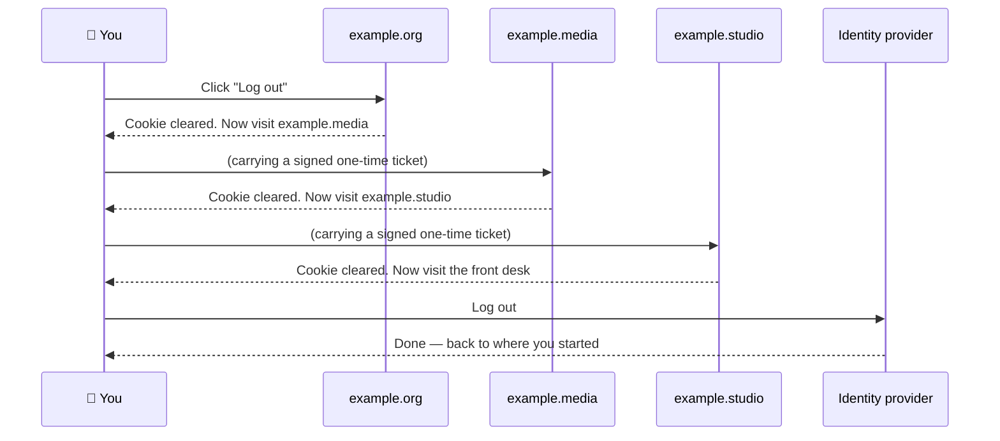

# leadstartsso
Single Sign-On Login for WordPress (Shared Logins Plugin Alternative)

# Leadstart SSO

**One login across several separate WordPress sites.** Sign in on one, and you're
signed in on all of them. Sign out of one, and you're signed out of all of them.

This is a companion to the [OpenID Connect Generic](https://wordpress.org/plugins/daggerhart-openid-connect-generic/)
plugin. It does not replace it — it adds the two things that plugin leaves out.

---

## Who this is for

You run **two or more separate WordPress installations** — different domains,
different databases, no multisite network — and you want people to sign in once.

If your sites are all in a single WordPress multisite network, **you don't need
this**. Multisite already shares logins. This plugin exists for the case where
that isn't an option.

---

## The problem, in plain terms

When you log into a WordPress site, it hands your browser a small file called a
**cookie**. On every page you visit afterwards, your browser shows that cookie
back to the site, and the site says "ah, it's you" and keeps you logged in.

Here's the catch, and it's a rule of the web itself, not a WordPress limitation:

> A cookie from `example.org` is **only ever** sent back to `example.org`.

Your browser will not show `example.media` a cookie that `example.org` gave it.
That's a deliberate security boundary — without it, any website could read your
banking session. But it also means that logging into one of your sites does
nothing for the others. Each one needs its own cookie, and only it can create one.



So the question isn't "how do we share one cookie across three sites" — we can't.
It's **"how does each site get its own cookie without asking the person to log in
three times?"**

---

## The idea

Put an **identity provider** in the middle — Auth0, Keycloak, Okta, Microsoft
Entra ID, any of them. Think of it as the front desk of an office building. You
show ID once at the desk; after that, every office inside can check with the desk
instead of asking for your ID again.

Two useful things follow:

1. **The identity provider gets its own cookie**, on *its* domain. Once you've
   signed in there, it remembers you — and every one of your sites can ask it
   about you.
2. **Each of your sites still issues its own cookie**, as WordPress requires.
   Nothing is shared or faked; each site logs you in properly, using the answer
   the identity provider gave it.

OpenID Connect Generic already handles step 2. What it doesn't do is *ask* — you
have to click a login button on each site. This plugin does the asking for you,
quietly, and handles the reverse for logging out.

---

## How logging in works

The trick is a standard OpenID Connect feature called **`prompt=none`**, which
translates roughly as: *"If you already know who this person is, tell me right
now. If you don't, say so — but don't show them a login screen."*

So on your first page view at a site you're not logged into, the plugin quietly
sends your browser to the identity provider and asks that question.



The whole exchange takes a fraction of a second and involves no typing, no
password and no clicking. You see a page load, and you're logged in.

**If you're not signed in at the identity provider**, it answers "no idea who
that is." The plugin quietly gives up, remembers not to ask again for 30 minutes,
and shows you the ordinary logged-out page. You never see an error.

> **Why not use a hidden iframe?** Many older tutorials plant cookies using
> invisible frames. That approach is dead: Safari has blocked third-party cookies
> outright since 2020, and Firefox isolates them so they silently vanish. This
> plugin uses a real, visible page navigation instead, so the browser treats each
> site as itself and every cookie is first-party.

---

## How logging out works

Logging out is the same problem in reverse. Clicking "log out" on one site
deletes *that* site's cookie. The other two have no idea.

So the plugin walks your browser through each site in turn, giving each one a
chance to clear its own cookie, and finishes at the identity provider so its
cookie goes too.



Each hop carries a **signed ticket** so a site can't be tricked into logging
people out by a link someone emails them, and each ticket names the one site it's
valid for.

That's two extra redirects, once, when you log out. You'll see the address bar
flicker.

---

## What actually travels between your sites

Very little, and this is deliberate.

| | Crosses between sites? |
|---|---|
| Your password | **Never.** WordPress never sees it at all — the identity provider holds it. |
| User accounts | No. Each site creates its own from what the identity provider says. |
| Roles and permissions | No. Each site works them out at login. |
| WooCommerce orders | No. Read live from the store site, never copied. |
| Specific fields you list | Yes, if you configure any. Nothing by default. |

The sites do talk to each other directly for a few small things, and when they
do, each request is **signed** — a fingerprint proving it came from a site that
knows your shared password and that nobody altered it in transit.

To be precise about a term people often get wrong: the requests are *signed*, not
*encrypted*. Signing proves **who sent it and that it wasn't tampered with**.
Privacy comes from HTTPS, which you should be using anyway.

---

## Requirements

- Two or more WordPress sites, each on **HTTPS**
- [OpenID Connect Generic](https://wordpress.org/plugins/daggerhart-openid-connect-generic/)
  installed, configured and working on every site
- An OpenID Connect identity provider (Auth0, Keycloak, Okta, Entra ID, …)
- WordPress 5.9+, PHP 7.4+
- WooCommerce — **only** if you want order history, and **only** on the one site
  that runs your shop

---

## Install

**Do this on every site.**

1. Get OpenID Connect Generic working on its own first. Confirm you can log in
   with it on each site individually. Don't continue until that works — this
   plugin can't fix a broken setup underneath it.
2. Install this plugin: **Plugins → Add New Plugin → Upload Plugin**, choose the
   `.zip`, activate.
3. Create one shared secret — a long random string. All sites use the **same
   one**. Either run:
   ```bash
   php -r "echo bin2hex(random_bytes(32)), PHP_EOL;"
   ```
   or click **Generate a secret** on the plugin's settings screen, which makes
   one in your browser without sending it anywhere.

---

## Configure

Each site needs three settings. The secret and the store are identical
everywhere; the peer list differs, because it names *the other* sites.

**If you can edit `wp-config.php`** (the better option — keeps the secret out of
database backups), add this above the `/* That's all, stop editing! */` line:

```php
define( 'LS_SSO_SECRET', 'the-long-random-string-from-step-3' );
define( 'LS_SSO_PEERS',  'https://example.media,https://example.studio' );
define( 'LS_SSO_STORE',  'https://example.org' );
```

**If you can't edit that file** — some managed hosts allow plugins but no file
access — put the same values in **Tools → Leadstart SSO → Settings** instead.

You can mix both approaches across sites. A constant always wins over the
settings screen on the same site, and the field then shows as read-only.

### At your identity provider

One application, with all your sites listed. In OpenID Connect Generic, tick
**Alternate Redirect URI**, then re-save **Settings → Permalinks** (this refreshes
WordPress's URL routing — skip it and the new address returns "not found").

Then register, for each site:

- **Callback URL** — `https://example.org/openid-connect-authorize`
- **Logout URL** — `https://example.org`

> **Auth0 users, one trap:** if you use a roles claim, its name must be a domain
> you own, like `https://example.org/roles`. Auth0 **silently discards** claims
> named under `auth0.com`, `webtask.io` or `webtask.run`. Nothing errors; the
> claim simply never arrives.

---

## Check that it works

Go to **Tools → Leadstart SSO** on each site.

1. **Status tab** — the shared secret shows a short **fingerprint** like
   `bc437472`. The same fingerprint must appear on every site. This lets you
   confirm the secrets match without ever displaying them.
2. **Test peers** — sends a signed request to each other site.
3. Then the real test: log in on one site as a **non-administrator**, and open
   another site in the same browser. You should arrive already logged in.

> Administrators are deliberately **excluded** from automatic login, so testing
> as an admin won't show you this working. See [Design decisions](#design-decisions).

Finally, try each site in a **private window with no session**. You should get a
normal logged-out page — not a redirect loop, not an error. This is the check
people skip, and it's the one that catches a bad rollout.

---

## When something goes wrong

**Test peers** reports a status code, and the three common ones mean completely
different things:

| Code | Meaning | Fix |
|---|---|---|
| **404** | No response route on that site — the plugin isn't installed or isn't active there. Your secret was never even checked. | Install and activate it there. |
| **503** | The plugin is there, but has no secret or peer list yet. | Configure that site. |
| **403** | The request arrived, was checked, and was refused — **the secrets don't match**. | Compare fingerprints. Usually a truncated paste. |

Work through it in that order: install everywhere, configure everywhere, then
test.

**"Logging out doesn't log me out of the others."** Check that **End Session
Endpoint** is set in OpenID Connect Generic. Without it, WordPress logs you out
but the identity provider still remembers you — so the next page view signs you
straight back in, which looks exactly like logout being broken.

**"Nothing happens at all."** If you installed to `mu-plugins`, note that
WordPress only loads `.php` files sitting *directly* in that folder — it never
looks inside subfolders. A folder on its own is silently ignored. You need the
small loader file alongside it, or just install it as a normal plugin.

---

## Design decisions

Things that look like omissions but are choices:

**Administrators are never logged in automatically.** They can log in normally by
clicking, but the silent path refuses them. If someone gets hold of an
identity-provider session, that shouldn't hand them an admin panel on every site
with no interaction at all. Adjust with `LS_SSO_BLOCK_SILENT_ROLES`.

**Nothing is copied between sites unless you ask.** No user table replication, no
address copying, no order duplication. Each piece of data has exactly one
authoritative home, so nothing can drift out of sync. WooCommerce orders in
particular are read live and never duplicated — two copies of an order record is
how you end up overselling stock.

**The shared secret prefers `wp-config.php`.** A signing key in the database ends
up in every backup and every export you hand a contractor. The settings screen
exists for hosts that give you no file access, and there the value is stored
without autoloading and never displayed again — only its fingerprint.

**The activity log records what happened, not what was in it.** Event type, which
site, success or failure. Never request contents, tokens or signatures. A log
that copies the payload is just a second, less-guarded copy of the same personal
data. Entries are deleted after 30 days.

---

## Extending it

```php
// Decide roles at login.
add_filter( 'ls_sso_map_roles', function ( $roles, $incoming, $user ) {
    return in_array( 'staff', $incoming, true ) ? array( 'editor' ) : array( 'customer' );
}, 10, 3 );

// Skip the automatic login check on certain pages.
add_filter( 'ls_sso_should_probe', function ( $should ) {
    return is_front_page() ? false : $should;
} );

// Keep activity log entries longer.
add_filter( 'ls_sso_log_retention_days', fn() => 90 );
```

Show order history on a site without WooCommerce with the shortcode
`[leadstart_orders]`.

---

## Licence

GPL-2.0-or-later.
